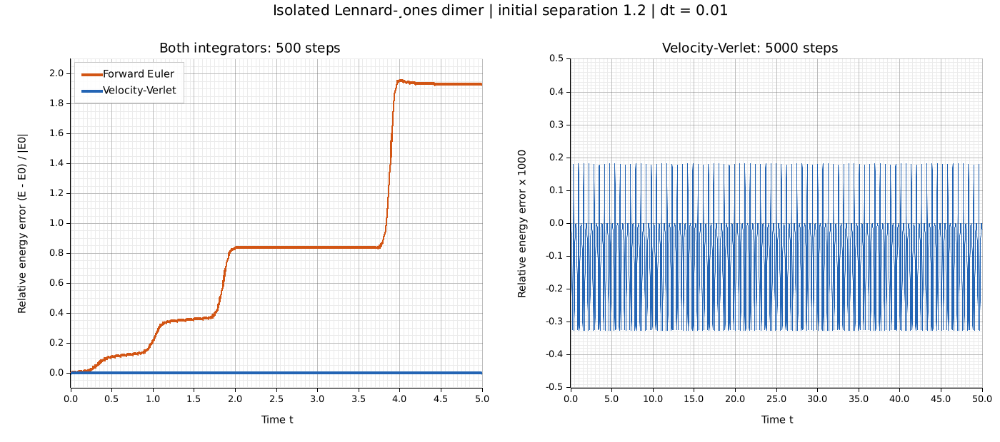

# Week 2: Part 3 — from force to motion

Two unit-mass atoms start at `(0, 0)` and `(1.2, 0)` with zero velocities.
The simulation uses two dimensions, open boundaries, the plain Lennard-Jones
potential, and the analytical radial force from Part 2. The timestep is `0.01`.

## Reproduce

Run these commands from the repository root (requires Rust/Cargo):

```bash
cargo fmt --manifest-path week2/md/Cargo.toml -- --check
cargo test --manifest-path week2/md/Cargo.toml -- --nocapture
cargo run --locked --manifest-path week2/md/Cargo.toml --example dimer
```

The final command writes `week2/dimer.png`. The output path is relative to the
crate's manifest directory, so it also works from other working directories when
the manifest path is adjusted. Plotters is a development dependency; PNG rendering
uses system TrueType fonts (for example, DejaVu Sans on Linux).

The left panel shows the signed relative error `(E(t) - E0) / |E0|` for both
integrators over 500 steps. The right panel shows Verlet over 5000 steps, with the
same signed error multiplied by 1000. Every step is sampled, including step zero.
Both curves come from this crate's integrators through `run_dimer`.



To write the 500-step comparison as CSV:

```bash
cargo run --quiet --manifest-path week2/md/Cargo.toml > /tmp/amat5315-dimer.csv
```

To verify the executable's CSV contract and the Week 1 program with pytest:

```bash
python3 -m pytest -q week1 week2/test_md.py
```

Install pytest in a Python environment if needed. In the implementation session,
Python lacked pip and ensurepip, so pytest was installed in a temporary environment
and the exact verification command was:

```bash
/tmp/amat5315-part3-venv/bin/python -m pytest -q week1 week2/test_md.py
```

## Acceptance results

| Measurement | Observed | Required |
|---|---:|---:|
| Verlet maximum absolute relative error, 500 steps | 0.0003250475924 | < 0.001 |
| Euler final signed relative error, 500 steps | 1.9317762831 | > 0.5 |
| Verlet maximum absolute relative error, 5000 steps | 0.0003250491974 | < 0.001 throughout |

The long Verlet run stays within essentially the same error envelope as the short
run. Euler accumulates large energy error. This is evidence for this initial state,
timestep, and finite duration, not a guarantee for every timestep or configuration.
The sheet's reference reports a roughly 3e-4 Verlet envelope; our measured maximum
is 3.25049e-4, comfortably below its explicit 1e-3 acceptance limit.

## Design and verification

`System` owns `Vec<[f64; 2]>` arrays for positions, velocities, and cached
accelerations. Measurement methods use `&self`, and accessors return borrowed
slices without cloning arrays. `Integrator::step` borrows `&mut System` to update
the state. `advance` accepts `&impl Integrator`, so the compiler selects the
concrete update rule through a shared generic interface.

Forward Euler updates position with the old velocity and velocity with the old
acceleration. Velocity-Verlet performs a half kick, drift, acceleration refresh,
and second half kick. Initial accelerations are computed once in `System::new`;
each later Verlet step computes them once and retains them for the next step.
Forces are equal and opposite for each pair, using `d = x_i - x_j` and
`F_i = force(r) d/r`. No numerical derivative is used by the simulator.

`tests/dimer.rs` invokes `run_dimer(&Euler, 0.01, 500)` and
`run_dimer(&VelocityVerlet, 0.01, 500)`. Only the integrator value differs;
initialization, stepping, and measurement use the same driver. The 5000-step test
checks every sample, not just the final energy.

All three Part 1/2 tests are retained. Additional Rust checks cover vector-force
direction and Newton's third law, kinetic energy, free flight, Euler's use of old
velocities, and Verlet time reversal over 200 forward plus 200 reversed steps.
The `vec!` macro constructs the owned particle arrays; `assert!` and `assert_eq!`
check numerical bounds and exact invariants in the tests.

The test-first history is preserved:

1. `1156102`: RED acceptance tests; `cargo test` failed with E0432 because the
   simulator API did not exist.
2. `9a38b5a`: GREEN simulator; all 10 Rust tests and both pytest tests passed.
3. A separate subsequent commit adds this documentation, the plotting example,
   its dependency lockfile, and the generated PNG.

The accepted [design](../docs/superpowers/2026-09-09-part3-design.md) and
[plan](../docs/superpowers/2026-09-09-part3-plan.md) record the architecture and
test-first sequence.
